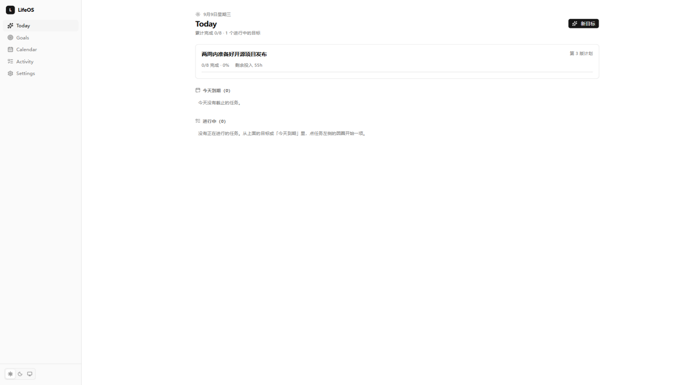
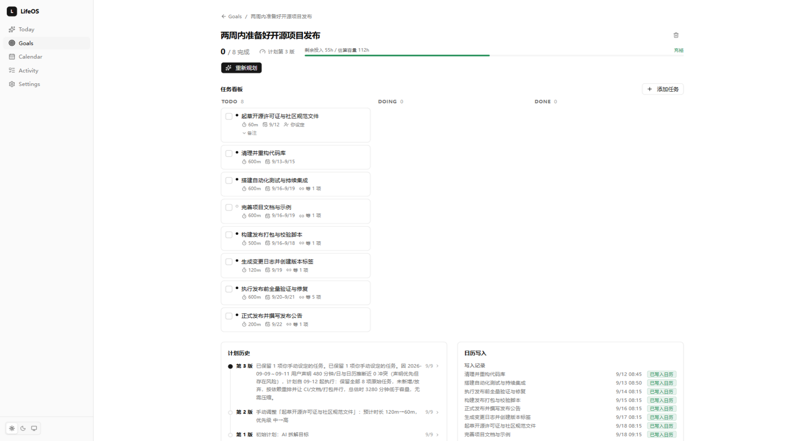
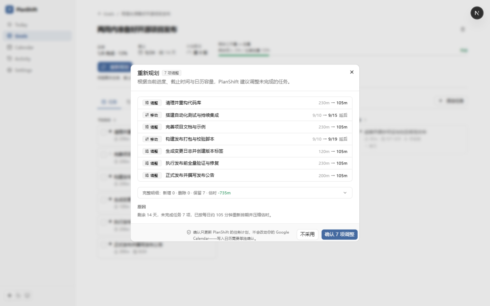
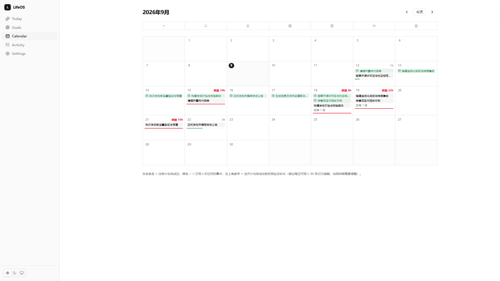

# PlanShift

**一个会根据目标、真实进度和日历变化持续重新规划的 AI Agent。计划赶不上变化，那就让计划跟着变化。**

> **Public Alpha（公开测试版）** —— 实验性项目，持续开发中。核心安全模型经过真实验证，产品打磨尚未完成，请预期粗糙边缘。

[English](README.md) · **简体中文**

<p align="center">
  <a href="#-demo-演示">演示</a> ·
  <a href="#-what-is-planshift-什么是-planshift">什么是 PlanShift</a> ·
  <a href="#-getting-started-快速开始">快速开始</a> ·
  <a href="#-safety-model-安全模型">安全模型</a> ·
  <a href="#️-known-limitations-已知限制">已知限制</a>
</p>

## 🎬 Demo 演示

观看完整的 90 秒流程 —— **目标 → AI 计划 → 手动编辑 → 重新规划 → 预览 → 确认 → 日历**：

**[▶ 观看演示（MP4）](recordings/planshift-demo-alpha.mp4)**

视频中的每一步都是真实产品运行：真实 LLM 规划、通过确认流程真实写入 Google Calendar。没有排练，没有伪造结果。

## 截图

| Today 今日 | Goal 目标与看板 |
|---|---|
|  |  |
| **Replan 重新规划预览** | **Calendar 日历** |
|  |  |

## 🤔 What is PlanShift？什么是 PlanShift？

PlanShift 不是待办事项应用。待办应用只是存储你输入的任务；PlanShift 在任务之外运行一个**代理闭环**：

```
目标
 → AI 计划（LLM 拆解）
 → 用户编辑（任务归你掌控）
 → 执行（看板 + 日历）
 → 重新规划（当现实发生偏移）
 → 预览（看清到底改了什么）
 → 确认（没有你的点头，什么都不生效）
 → 日历（草稿 → 确认 → 写入 → 校验）
```

**AI 提议，用户决策，确定性守卫强制约束。**

LLM 永远不会直接碰你的日历，也永远不会悄悄改写你编辑过的任务。每次计划变更都有 diff、有预览、有版本、可撤销。容量计算、依赖排序、排期钳制全部由普通代码强制执行——不依赖模型"自觉"。

## ✨ 核心特性

- **自然语言目标规划** —— 一句话变成带估时、带依赖顺序的任务计划
- **AI 任务拆解** —— 一次性任务与周期型习惯（`durationDays`），逐日估时
- **用户掌控的任务编辑** —— 新建/编辑/删除，带校验、乐观锁、循环依赖拒绝
- **用户优先的重新规划** —— 你编辑过的任务标记为 `origin=user`，AI 永不改写
- **计划预览 / 确认 / 撤销** —— 每次重排先看 diff，显式确认后才应用
- **PlanVersion 版本历史** —— 每个修订都有快照，支持多级撤销
- **依赖校验** —— 计划生成与手动编辑时都会拒绝循环依赖
- **容量感知规划** —— 工作日 × 每日可投入分钟数；AI 任务被压缩，你的任务受保护
- **个人规划设置** —— 每日分钟数、工作日、工作时段、时区、目标日历
- **GitHub 只读进度上下文** —— 目标描述里写 `repo:owner/name` 即可接入公开 issue/PR/CI 信号
- **日历读取上下文** —— 从你的日历推断忙碌时段；用户声明优先
- **日历草稿 → 人工确认 → 幂等写入 → 校验**
- **Google Calendar 集成**（OAuth + PKCE、最小权限），本地 ICS 兜底
- **幂等写入恢复** —— 中断的批次重试即收敛，零重复事件
- **时区安全的 Instant 模型** —— 内部 UTC，边缘 IANA 墙钟，DST 安全
- **可靠性 / 对账审计** —— 一键 DB ↔ 日历对账 + trace 指标

## 🏗 架构

```
Next.js 16 + TypeScript（App Router、Prisma、SQLite/可迁移 PostgreSQL）
        ↓  Agent Client（AGENT_MODE=auto：Python 优先，TS 本地兜底）
FastAPI  ·  Python 3.12  ·  无状态
        ↓
LangGraph：Analyze → [GitHub 工具] → [Calendar 工具] → Plan|Replan → Validate → Finalize
        ↓                                      ↘ 确定性守卫（与 TS 守卫镜像）
LLM（任意 OpenAI 兼容端点）
```

- **TS 确定性守卫**（`src/lib/plan.ts`）：依赖清洗、排期钳制、任务数守卫、容量预算 —— 与 Python 共享测试向量（`docs/constraints-vectors.json`）
- **Python Agent Core**（`agent/app`）：提示词、校验、Finalize 收敛、trace
- **数据库**：当前 SQLite（Prisma）；schema 未用任何 SQLite 专有特性，可直接迁 PostgreSQL
- **Google Calendar Provider**：OAuth Desktop 流程、token 存储（开发 file / 生产 OS 凭据管理器）、仅 CREATE 的幂等协议
- **GitHub 工具**：只读、公开数据、匿名或 `GITHUB_TOKEN`

## 🛡 安全模型

- **AI 不能写日历。** 写入只走 `草稿 → 用户确认 → 执行 → 校验`。"代理自己决定后直接写入"在架构上不可能。
- **用户来源的任务受保护。** 你编辑过的任务携带 `origin=user`；重排时逐字保留——标题、估时、优先级、日期、依赖。
- **确定性校验** —— LLM 提议，代码强制：依赖清洗（去环）、排期钳制到 `[今天, 截止日]`、任务数守卫、容量预算。
- **循环依赖防护** —— AI 计划和手动编辑两侧都拒绝，并给出可见原因。
- **幂等性** —— 每次日历写入携带唯一幂等键；provider 预检 + DB 门 + 超时后回查。已在故障注入下验证：零重复事件。
- **过期检查** —— 写入前用 Instant 比较重新检查时段占用；被占时段跳过并标记，绝不覆盖。
- **乐观锁** —— 并发任务编辑会被检测（409），不会静默互相覆盖。
- **PlanVersion / 撤销** —— 每个计划修订保留应用前快照；撤销沿版本链逐级回退。
- **凭据卫生** —— token/密钥永不进入提示词、日志、trace 或错误响应；trace 脱敏有单测覆盖。

## 🧰 技术栈

| 层 | 技术 |
|---|---|
| Web / API | Next.js 16（App Router）· React 19 · TypeScript · Tailwind 4 · shadcn/ui |
| 数据 | Prisma 6 · SQLite（可迁移 PostgreSQL） |
| Agent Core | Python 3.12 · FastAPI · LangGraph · Pydantic · httpx |
| 集成 | Google Calendar API（OAuth+PKCE）· GitHub REST（只读） |
| LLM | 任意 OpenAI 兼容端点（如 DeepSeek、OpenAI）+ 内置确定性 mock |
| 测试 | Vitest（117）· Pytest（178） |

## 🚀 Getting Started 快速开始

### 环境要求

- Node.js ≥ 20 + npm
- Python ≥ 3.12（下方创建 venv）
- Google Calendar **可选** —— 不配置也能完整运行（本地 ICS provider，或干脆不用日历功能）

### 安装

```bash
# 1. 前端依赖
npm install

# 2. Python agent 依赖
cd agent
python -m venv .venv
.venv/Scripts/pip install -e .            # Windows
# .venv/bin/pip install -e .              # macOS/Linux
cd ..

# 3. 环境变量 + 数据库
cp .env.example .env                      # 想接真实 LLM 就编辑它（见下）
npx prisma db push                        # 创建 prisma/dev.db
```

### （可选）配置真实 LLM

编辑 `.env` —— 任意 OpenAI 兼容端点皆可：

```ini
LLM_BASE_URL="https://api.deepseek.com"   # 或 https://api.openai.com/v1
LLM_API_KEY="<你的密钥>"
LLM_MODEL="deepseek-chat"
```

**降级语义（务必阅读）：** 不填密钥时，两侧都使用内置确定性 mock —— 产品闭环照常工作，只是计划为模板质量。填了密钥后 `AGENT_MODE=auto` 优先走 Python agent；若不可达/超时/契约不匹配，Web 层**会**降级到本地规划器 —— 该降级目前正在补 UI 提示；今天若计划"好得可疑地模板化"，请查看 agent 日志确认。

### 启动

```bash
# 终端 1 —— Python Agent Core（:8000）
npm run agent            # 或：npm run agent:full（读取 .env、自动探测日历配置）

# 终端 2 —— Next.js（:3000）
npm run dev

# 浏览器 → http://localhost:3000
```

启动顺序不严格。创建一个目标，你就进入了这个闭环。

### Google Calendar（可选）

1. [Google Cloud Console](https://console.cloud.google.com/) → 创建 **OAuth 客户端（Desktop 应用）**
2. 下载客户端密钥 JSON → 保存为 `agent/google-credentials.json`（绝不能提交）
3. `.env` 中设：`CALENDAR_PROVIDER=google`
4. 授权一次：`cd agent && .venv/Scripts/python smoke_google.py`（打开浏览器，state + PKCE 一次性会话）
5. token 存储在 `agent/.google-token.json`（绝不能提交）

日历写入**永远**经过显式确认弹窗 —— 创建任何事件之前，你会看到完整的事件清单。

## 🧪 测试

```bash
npm test                                        # Vitest —— 核心守卫、API、日历协议（117 用例）
cd agent && .venv/Scripts/python -m pytest      # pytest —— Agent Core（178 用例）
npm run build                                   # 生产构建（tsc 严格模式）
agent/.venv/Scripts/python scripts/reliability-audit.py   # DB ↔ 日历对账
```

## ⚠️ 已知限制

- **慢速/受限网络下的日历写入。** 确认是同步批量操作；在极慢链路（无法直连 Google）上超过几个事件的批次可能超出请求预算。写入是幂等的，**再次点击确认即可安全收敛** —— 零重复、无需手工清理。后续计划用后台执行队列解决。
- **日历 Update/Delete 未实现** —— 写入仅 CREATE；重排不会改写你日历上已有的事件（会提示你重新生成草稿）。
- **Email 工具未实现。**
- **跨午夜工作时段不支持** —— 设置会拒绝结束时间早于开始时间的时段。
- **重排降级可见性** —— Python agent 不可达时自动降级本地规划器；UI 上的呈现还比较粗糙。
- **单用户** —— 无鉴权/多租户；当前定位就是个人工具。

## 📌 项目状态

**Public Alpha。** 适合开发者、实验与个人 dogfooding。
不承诺生产 SLA，不承诺企业级就绪。数据模型仍可能变化；导出请自行处理（毕竟是 SQLite）。

## 🗺 路线图（方向，不承诺时间）

- 日历后台执行队列（消除慢网络吞吐上限）
- 日历事件 Update/Delete（同样走确认纪律）
- 降级/回退状态在 UI 中显式呈现
- PostgreSQL 部署方案

## 参与贡献

见 [CONTRIBUTING.md](CONTRIBUTING.md)（英文）。欢迎 issue 与 PR —— 请先读安全模型；削弱确认/幂等保证的 PR 会被拒绝。

## 安全

见 [SECURITY.md](SECURITY.md)（英文）。简言之：**绝不提交** `.env`、`google-credentials.json`、token 文件或任何密钥。漏洞请私密报告。

## 许可证

[MIT](LICENSE)
